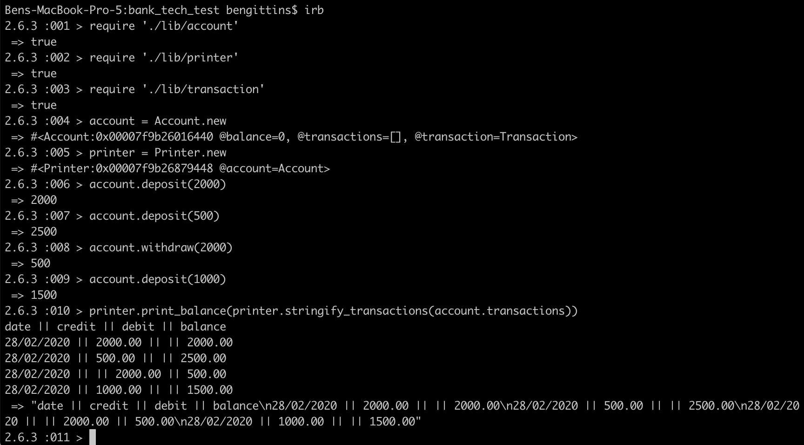

# Bank Tech Test :bank:
This is a a technical test from Week 10 of the Makers bootcamp. 

The program allows a user to make deposits to and withdrawals from their bank account. They can also print statements showing their transactions. 

The program can be used in IRB. 

## Installation ##
- Fork and clone the repo. 
- run  ``` bundle install ``` 
- require files in your IRB

## Tech Used ##

Built with Ruby. 

Tested with Rspec. 

The program was developed using Test Driven Development. 

## Structure ##
I split the program into three classes each with a distinct responsibility to maintain encapsulation. 

## Tests ##

Code Quality/Test Coverage ensured with Rubocop and Simplcov. 

To run tests simply run rspec in the root of the project. 

Test Coverage = 100%

## Example of Functionality ##

**Given** a client makes a deposit of 1000 on 10-01-2012  
**And** a deposit of 2000 on 13-01-2012  
**And** a withdrawal of 500 on 14-01-2012  
**When** she prints her bank statement  
**Then** she would see:  

```date || credit || debit || balance
14/01/2012 || || 500.00 || 2500.00
13/01/2012 || 2000.00 || || 3000.00
10/01/2012 || 1000.00 || || 1000.00
```
Example of program output:



